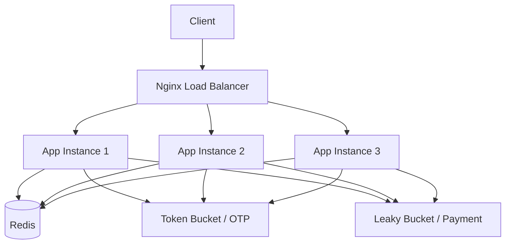

# High-Throughput Distributed API Rate Limiter

> A distributed rate limiter built with **Java 21, Spring Boot, Redis, Lua, Docker, and Nginx**.
>
> Designed to enforce rate limits consistently across multiple application instances using shared Redis state.

---

## 🏗️ Architecture



### Request Flow

```text
Client
  │
  ▼
Nginx :8000
  │
  ├──► App 1 :8080 ─┐
  ├──► App 2 :8080 ─┼──► Redis :6379
  └──► App 3 :8080 ─┘
```

All three application instances share the same Redis state, so rate limits remain consistent regardless of which instance receives a request.

---

## ⚡ Key Features

| Feature | Implementation |
|---|---|
| **Token Bucket** | OTP rate limiting |
| **Leaky Bucket** | Payment request queuing |
| **Distributed State** | Redis |
| **Atomic Rate Limiting** | Redis Lua scripts |
| **Load Balancing** | Nginx |
| **Multiple Instances** | 3 Spring Boot containers |
| **Containerized** | Docker + Docker Compose |
| **Integration Testing** | Testcontainers |

---

## 🧰 Tech Stack

<div align="center">


</div>

---

## 🚦 Rate-Limiting Configuration

### Token Bucket — OTP

- Capacity: **100 requests**
- Refill rate: **100 requests/minute**
- Bucket TTL: **300 seconds**
- Redis key: `tb:<userId>:otp`

### Leaky Bucket — Payment

- Queue capacity: **100 requests**
- Leak rate: **100 requests/minute**
- Worker interval: **600 ms**
- Redis-backed queue
- Returns `202 Accepted` when a payment is queued

---

## 🚀 Run the Project

### Prerequisites

- Git
- Docker Desktop
- Docker Compose
- Java 21
- Maven

### 1. Clone

```bash
git clone https://github.com/SneakySolo/distributed-rate-limiter.git
cd distributed-rate-limiter
```

### 2. Build the application

The Dockerfile expects the Spring Boot JAR to already exist in `target/`.

```bash
mvn clean package -DskipTests
```

### 3. Start the complete system

```bash
docker compose up -d --build
```

This starts:

- 3 Spring Boot application instances
- 1 Redis instance
- 1 Nginx load balancer

### ⚠️ Important: Wait ~60 Seconds

After `docker compose up -d --build`, **wait around 60 seconds before testing through Nginx**.

Nginx may start before the Spring Boot application containers are fully ready and connected. Giving the services time to initialize avoids testing while the upstream containers are still starting.

```powershell
Start-Sleep -Seconds 60
```

Then verify:

```bash
curl http://localhost:8000/health
```

Expected:

```json
{"status":"UP"}
```

---

## 🧪 Test the Rate Limiter

### OTP — Token Bucket

Send requests through Nginx:

```powershell
1..110 | ForEach-Object {
    curl -s -o $null -w "%{http_code}`n" `
    -X POST http://localhost:8000/otp/send `
    -H "X-User-Id: test-user" `
    -H "Content-Type: application/json" `
    -d '{"phoneNumber":"1234567890"}'
}
```

The first requests consume tokens from the shared Redis bucket. Once the limit is exhausted, the API returns:

```text
429 Too Many Requests
```

### Payment — Leaky Bucket

```powershell
curl -i `
  -X POST http://localhost:8000/payment/process `
  -H "X-User-Id: test-user" `
  -H "Content-Type: application/json" `
  -d '{"amount":100}'
```

A successful request returns:

```text
202 Accepted
```

with a request ID that can be used to check payment status.

---

## 🔍 Verify Distribution

Nginx exposes the selected backend through the `X-Backend` response header.

```bash
curl -i http://localhost:8000/health
```

Look for:

```text
X-Backend: app1:8080
```

Repeated requests should be distributed across the three application instances while the rate-limit state remains shared through Redis.

---

## 🧹 Stop the System

```bash
docker compose down
```

To remove the Redis volume as well:

```bash
docker compose down -v
```

---

## 🧪 Testing

The project includes:

- Unit tests for Token Bucket and Leaky Bucket
- Controller tests
- Redis/Testcontainers integration tests
- Distributed atomicity tests
- Multi-instance HTTP tests

Run the test suite with:

```bash
mvn test
```

Docker Desktop must be running for Testcontainers-based tests.

---

## 🗺️ Roadmap

### Version 1 — Current

**Phase 1 + Phase 2**

- [x] Token Bucket
- [x] Leaky Bucket
- [x] Redis-backed distributed state
- [x] Atomic Redis Lua scripts
- [x] Multiple Spring Boot instances
- [x] Nginx load balancing
- [x] Docker Compose
- [x] Distributed integration testing

### Version 2

Monitoring and performance analysis will be added in the next version:

- [ ] **Prometheus** metrics
- [ ] **Grafana** dashboards
- [ ] **k6** load testing and benchmarking
- [ ] Additional observability and performance analysis

---

## 📌 Project Status

**Current version: `v1.0 — Phase 2 complete`**

The current release focuses on the core distributed rate-limiting system and infrastructure. Monitoring, benchmarking, and additional observability are intentionally reserved for **Version 2**.
